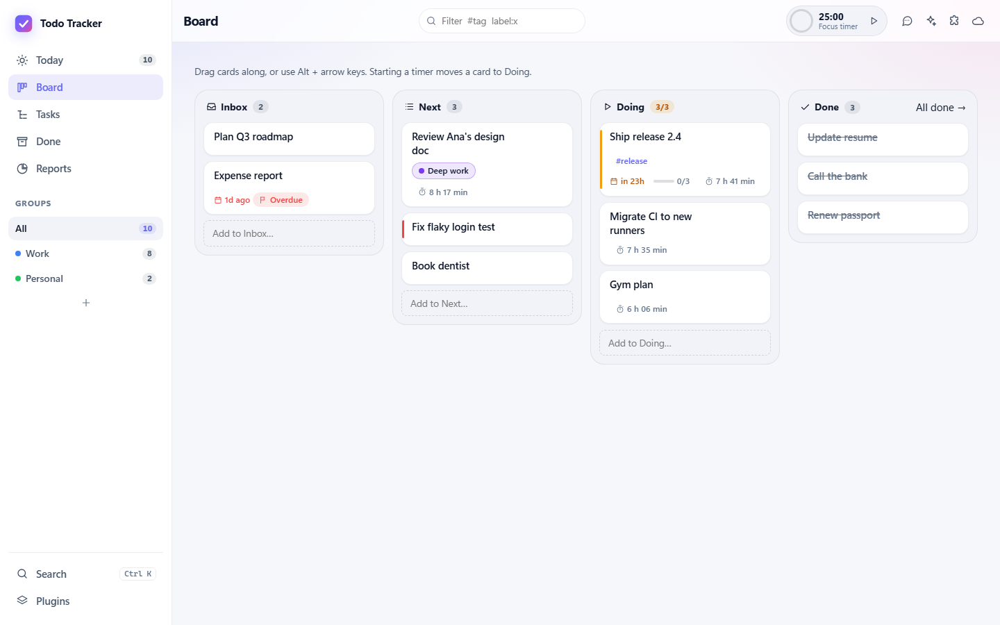
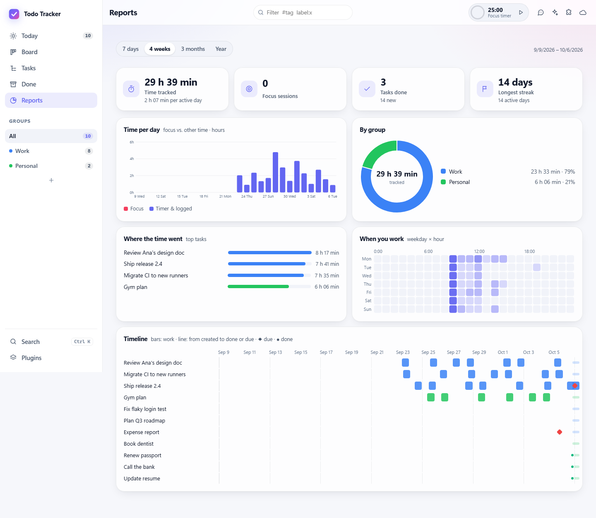

# Todo Tracker

An ADHD-friendly task sidebar that always tells you **what to do now**. Deferred work stays out of sight and comes
back on time with a reminder. Rollout steps unlock themselves 24 hours apart, and AI apps (Claude, Copilot, ChatGPT,
VS Code…) can read your list and add, organize and finish tasks for you.

Your tasks are **plain markdown files in a folder you own**, ready for Obsidian, git, sync services, and AI agents
that work with files. Every change is versioned, and nothing needs a Save button.

| | |
|---|---|
| **Windows** | Native WPF sidebar docked to the screen edge (maximized windows don't cover it), toasts, `Ctrl+Alt+Space` quick capture, the whole app in its own window (**⋯ › Open the app**), a task timer in the sidebar, and a full-screen break on every monitor when a focus session ends (**⋯ › Full-screen breaks**) |
| **Web** | The whole app at `http://127.0.0.1:5317`: Today, a Board (Inbox → Next → Doing → Done), a Tasks outline, Done & Archive, Reports with charts and a timeline; works on phones too |
| **Time** | A timer on every task (one runs at a time), focus sessions with a full-screen break, time reports by day, group and task |
| **macOS / iOS** | Native SwiftUI apps (macOS adds a menu bar glance and syncs with your other computers) |
| **Linux** | A tray app (`todo-tracker`): runs everything (tasks folder, sync, the web app, MCP); click it for the full window, its menu adds a task and runs the focus timer |
| **Android** | A native app (Kotlin, Jetpack Compose): Today with the one thing to do now, Do now, Waiting, groups, quick capture, snooze and notes, task timers and the focus timer with full-screen breaks; the same rules as every other app (CI builds the APK) |
| **Browser** | Edge/Chrome side panel: glance, capture, and notes that attach the current page |
| **AI apps** | `tt mcp` (stdio) and `/mcp` (HTTP) MCP servers, a Claude Desktop extension, a Claude Code / Copilot CLI plugin with a skill, OpenAPI for GPT Actions and Copilot Studio; changes are attributed to the agent |
| **Terminal** | `tt` CLI: `tt now`, `tt add …`, `tt done …`, `--json` for scripts and agents |
| **Teams** | Reminder cards through a Teams Workflows webhook |
| **Ask AI** | Chat with Copilot, Claude Code or a model with an API key in the app, with every chat kept: "add: call the bank tomorrow, renew passport !!" |
| **Plugins** | Every extra can be switched off ([`docs/plugins.md`](docs/plugins.md)) |
| **Sync** | Your computers stay in step through OneDrive, iCloud Drive or a private GitHub gist, merging changes made on both ([`docs/sync.md`](docs/sync.md)) |
| **Connectors** | Keep a group in step with a Notion database or a Microsoft To Do list (both ways, never deleting anything), or copy it as a checklist into Loop ([`docs/connectors.md`](docs/connectors.md)) |
| **Files** | An Obsidian-compatible markdown vault (`Documents/Todo Tracker` by default), with version history |

The full plan, design, rules, and requirement traceability are in [`docs/product-spec.md`](docs/product-spec.md). The original request is in [`docs/request.md`](docs/request.md).

## Screenshots

| Web dashboard | Dark mode |
|---|---|
|  |  |

| Windows sidebar | macOS / iOS | Browser side panel |
|---|---|---|
|  |  |  |

The report page shows the full task tree and a timeline: 

| Board | Reports |
|---|---|
|  |  |

## Quick start (Windows)

```powershell
dotnet run --project src/TodoTracker.Windows
```

The sidebar docks on the right. To move it, use **⋯ › Position**:
- **Dock right** or **Dock left** reserves that edge, on any monitor.
- **Float as a window** makes it a normal window you can drag and resize. Turn on **⋯ › Always on top** if you want it
  to stay above other windows.

Your choice is remembered. Todo Tracker also sits in the notification area (the tray): click its icon to bring the
sidebar back; right-click it to open the full window, add a task, start or pause the focus timer, hide the sidebar
(it gives the screen edge back) or quit. A red dot on it means a reminder is due.

**Order Do now your way:** drag a card (drop it on the big card to make it the focus),
or use its ↑/↓ buttons or Alt+↑/↓. New tasks go below the ones you arranged, so your focus stays put; a task whose
reminder is due still shows first. Subtasks reorder the same way in the web task panel.

Type a task in the box at the top and press Enter:

```
Deploy ring 2 !! @2h due:tomorrow      →  critical, back in 2h with a reminder, due tomorrow 17:00
Plan the offsite @next-week            →  back next Monday 9:00   (also @fri, @weekend, @tonight, @2w…)
```

**Not now?** Press **Later** on a task: back in 15 minutes, an hour, 3 hours, this evening, tomorrow morning, in 2 days,
next Monday, in a week or a month (each says when, e.g. *Fri 9:00*). Or **Pick a time…** and type it the way you'd say
it (`next week`, `fri 14:30`, `3d`, `weekend`, `2026-03-01 14:00`; it shows when that is before you snooze), or pick a
date. Or **After another task…**: it waits until that task is done, then comes back with a reminder. Every app offers
the same choices (`tt snooze <task> next week`, `tt snooze <task> after <other task>`, and the AI tools too).

### The full app

The web app (and the app window on Windows) has five views; switch with the side bar, `Alt+1`…`Alt+5`, or `Ctrl+K`:

- **Today**: what to do now (the same list as the sidebar).
- **Board**: Inbox → Next → Doing → Done. Drag cards along, or focus one and press `Alt+←/→` (`Alt+↑/↓` within a
  column). Doing is kept to three on purpose. New tasks start in Inbox.
- **Tasks**: every task as an outline. Type to rename, `Enter` for the next task, `Tab`/`Shift+Tab` to nest and
  un-nest, `Alt+↑/↓` to move, `Space` to finish, `Esc` to leave; or drag a row before, after or into another.
- **Done**: what you finished, day by day, with the time it took. Archive finished tasks (or everything older than a
  week or a month) to keep it short; bring them back from **Archive**, or delete them.
- **Reports**: time tracked, focus sessions and tasks done for a week, a month, three months or a year, with time per
  day, a donut by group, where the time went, when you work (weekday × hour), active days, and a timeline of each
  task's work, deadline and finish.

Open a task to edit everything in one place; the expand button makes it full size (with its own address, so Back
closes it). Its **Time** section starts or stops the timer and lists the time spent, which you can fix, remove or add
by hand. Starting a focus session on a task starts that task's timer too (the session's time counts as focus time on
it). When the session ends, a full-screen break reminds you to rest: take it, skip it, or **Start next focus now**
(same task, the break ends). When a break you saw runs out, it asks **Break's over: Start next focus** or **Not now**;
on Windows the notification has the button too. The phone apps do the same (Android and iPhone), and say
when a focus session or a break ends with the app closed.

To set up a rollout, open the task (⋯ › *Edit details in browser* › *Add rollout steps*), enter one step per line,
and choose 24 hours between steps. Only the current step shows in **Do now**. When you finish it, the next step
waits 24 hours and then comes back with a reminder.

### Where your tasks live

Tasks are markdown files in **Documents/Todo Tracker**: one folder per group (tab), one file per task, with subtasks
as checkboxes (Obsidian Tasks syntax), notes as callouts, and attachments next to them. Edit them anywhere: in the
app, in Obsidian, in an editor, or with an AI agent. The app picks the changes up. See
[`docs/vault-format.md`](docs/vault-format.md).

- **Use Obsidian:** **⋯ › Tasks folder › Keep tasks in an Obsidian vault** lists your vaults. The app then uses
  `<vault>/Todo Tracker` (restart to switch). Any task opens in Obsidian from its menu or the web drawer.
- **Pointing the app at existing notes is safe.** It reads them without rewriting anything until you change a task.
- **History:** every change is saved as a version (needs `git`). Open a task in the web drawer › *History* to view or
  restore a version.
- **Tags, labels, search:** add `#tags` and colored labels to tasks; click one (or press `/`) to filter. The same
  syntax works everywhere: `#release label:"Deep work" group:work is:done words`.

### Connect AI apps

Choose **⋯ › Connect an AI app** (or ✨ in the web dashboard), pick Claude Code, Copilot CLI, Claude Desktop, VS Code
or another app, and copy the one line it shows. For example:

```bash
claude mcp add todo-tracker --scope user -- tt mcp
```

`tt mcp` works on your tasks folder directly, so AI apps work even when Todo Tracker isn't running. There is also a
Claude Desktop extension (`.mcpb`), a plugin with a skill for Claude Code and Copilot CLI
(`/plugin marketplace add shahabmokhtari/todo-tracker`), and OpenAPI descriptions for cloud tools. See
[`docs/ai-connectors.md`](docs/ai-connectors.md), including ChatGPT and Copilot Studio.

### Ask AI and plugins

Type in the **Ask AI** box at the bottom of the sidebar (or the chat button in the dashboard): Copilot, Claude Code,
or a model you add with an API key (OpenAI, Anthropic, Azure, OpenRouter, Ollama, LM Studio…) adds, finds and
organizes tasks for you, asking before it changes anything. Every chat is kept: **Chats** finds, reopens, renames or
deletes them. Turn any extra off under **⋯ › Plugins**. See [`docs/plugins.md`](docs/plugins.md).

### Browser extension

Edge, Chrome and Safari. Open **Browser extension** (puzzle button in the dashboard, or **⋯ › Set up the browser
extension** in the sidebar): it walks you through loading it (it isn't in the stores yet) and pairs it with a 6-digit
code. See [`docs/browser-extension.md`](docs/browser-extension.md).

### Teams reminders

Choose sidebar menu **⋯ › Connect Teams reminders…** and paste a Teams Workflows webhook URL.

## Linux

CI builds `todo-tracker-linux-x64.tar.gz` (artifact **linux-tray**; no .NET needed). Unpack it and run `./install.sh`
(add `--autostart` to start it with your session): it puts Todo Tracker in your app menu and `todo-tracker` and `tt` in
`~/.local/bin`. The icon sits in the tray; on GNOME, tray icons need the AppIndicator extension. A second start opens
the running one's window.

## Other platforms

```bash
# Web dashboard / API / MCP without the WPF shell (any OS)
dotnet run --project src/TodoTracker.Web -- --port 5317 --data ./data

# macOS / iOS (on a Mac with Xcode)
cd apple/TodoTrackerKit && swift test
cd apple && brew install xcodegen && xcodegen generate && open TodoTracker.xcodeproj
```

## Development

```bash
dotnet build TodoTracker.slnx -warnaserror
dotnet test --solution TodoTracker.slnx               # xUnit v3 on Microsoft Testing Platform
node --test tests/web/*.test.mjs extension/tests/*.test.mjs
cd tests/e2e && npm install && npx playwright install chromium && npx playwright test
```

Notes for contributors:

* **Shared fixtures** in `tests/fixtures` are checked by more than one platform. `scenarios/*.json` and `breaks.json`
  are hand-written. `export.json` (the board `/api/export` sends, which the Mac app reads) is written by C#: after
  changing the board format, run `ExportFixtureTests` with `TT_WRITE_FIXTURES=1` and commit the result.
* **Swift** (apple/) only builds and runs its tests in CI (macOS runner); keep Swift changes small and covered by
  `swift test`.
* `extension/lib/format.js` and `icons.js` are exact copies of the web app's (a test checks): copy them after changing
  either.
* Only one copy of the Windows app runs at a time: stop it before running a test build (it's fine to stop the copy
  you use, as long as you start it again afterwards). Point a test copy at its own folder with `--data <folder>`
  and `--port`, and set `TODOTRACKER_CLOUD=off` so it never syncs into your OneDrive.
* **Android** builds and runs its unit tests locally with JDK 17, Gradle 8.11 and the Android SDK (platform 35):
  `gradle testDebugUnitTest assembleDebug` in `android/`. An emulator (`system-images;android-35;google_apis;x86_64`)
  runs the app for checks by hand; `adb shell date @<seconds>` moves its clock (as root) to reach a break quickly.
`src/TodoTracker.Windows/bin/.../TodoTracker.exe --smoke-test --smoke-log smoke.log` boots the real app against a
temporary board and verifies that the API and the sidebar see the same data. CI runs it on every PR.

System tests drive the real sidebar with UI Automation on the live Windows shell (pass `-Exe <path to TodoTracker.exe>`):
* `tests/system/placement.system-test.ps1`: dock right/left, float, always on top, persistence across restarts,
  and a floating window being pulled back on screen after a display change. Runs in Windows CI.
* `tests/system/multimonitor.system-test.ps1`: docks and floats on every display (including displays at negative
  coordinates), checks that only that display's work area changes, that the display is saved by its stable device
  path, and that a display change keeps the sidebar on it. Needs two or more monitors, so it skips in CI.
  Run it locally after changing placement code.

| Path | What |
|---|---|
| `src/TodoTracker.Core` | Domain model, agenda rules, search, quick capture, focus timer, markdown vault store and history, reminder dispatcher |
| `src/TodoTracker.Server` | REST API, MCP tools, security, Teams notifier, reminder loop, embedded web UI (`wwwroot`) |
| `src/TodoTracker.Web` | Standalone server host |
| `src/TodoTracker.Cli` | `tt` command and `tt mcp` (MCP over stdio) |
| `integrations/` | Claude Desktop extension manifest, Claude Code / Copilot CLI plugin and skill, VS Code sample |
| `src/TodoTracker.Desktop` | Platform-neutral view models for the sidebar |
| `src/TodoTracker.Windows` | WPF sidebar (AppBar, toasts, hotkey) |
| `apple/` | Swift core port, SwiftUI UI, and XcodeGen project for iOS and macOS |
| `extension/` | Edge/Chrome side panel extension |
| `tests/fixtures/scenarios` | Shared agenda scenarios run by both the C# and Swift tests |

CI (`.github/workflows/ci.yml`) runs on Linux (core, server, CLI, view models, coverage gates), web (JS tests and
Playwright), AI connectors (the `tt` tool package, self-contained `tt` and Claude Desktop extensions for Windows, macOS
and Linux, manifest validation, an MCP smoke test of the bundle), Windows (full build, tests, publish, smoke test), and
macOS (Swift tests, iOS and macOS app builds).
