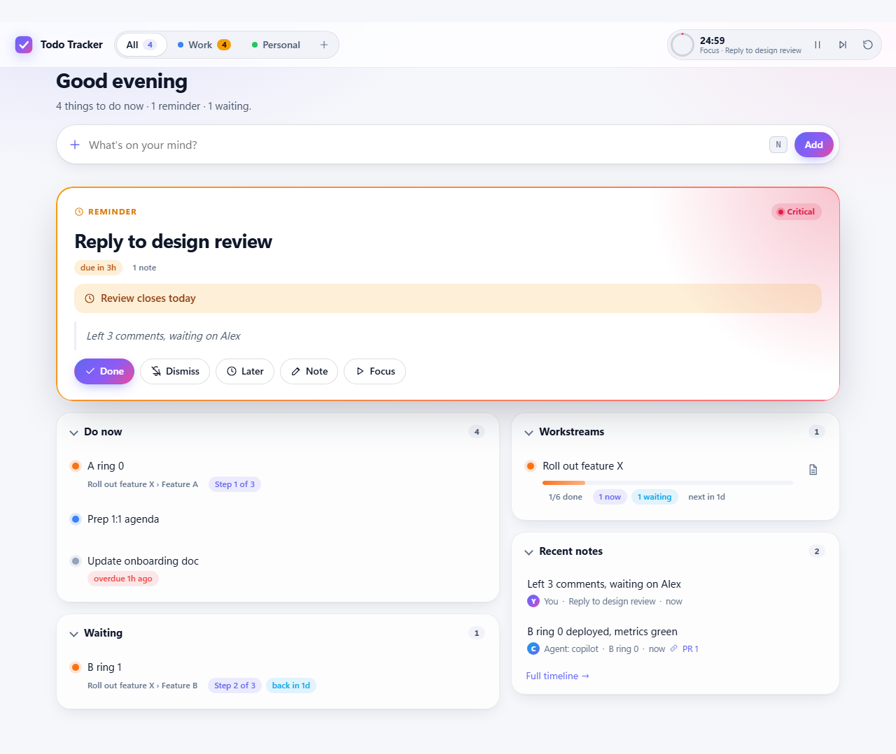
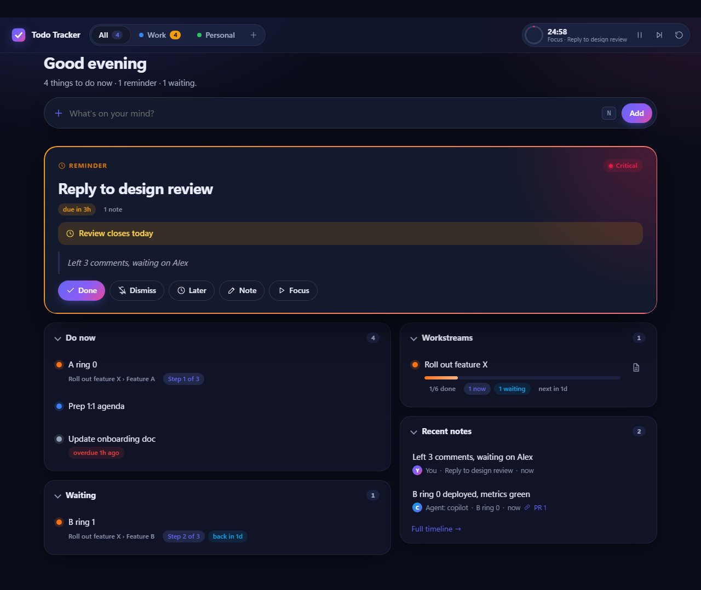
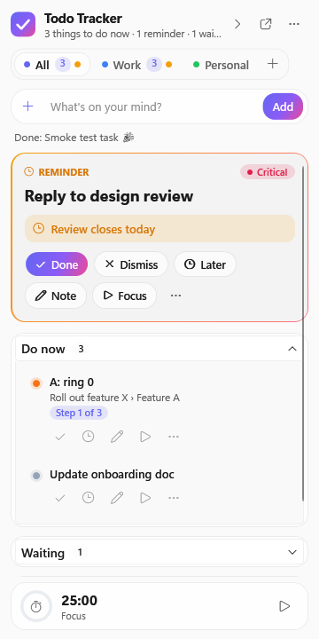
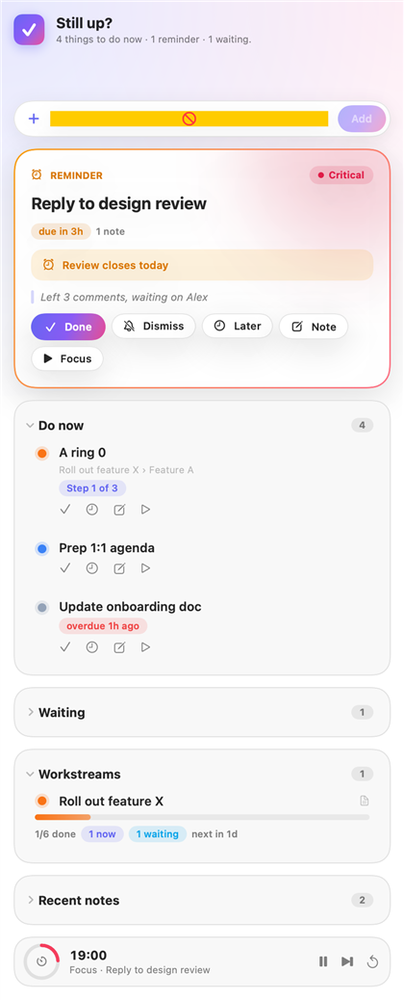
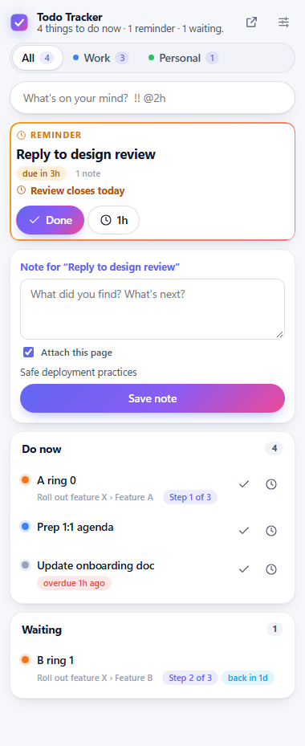
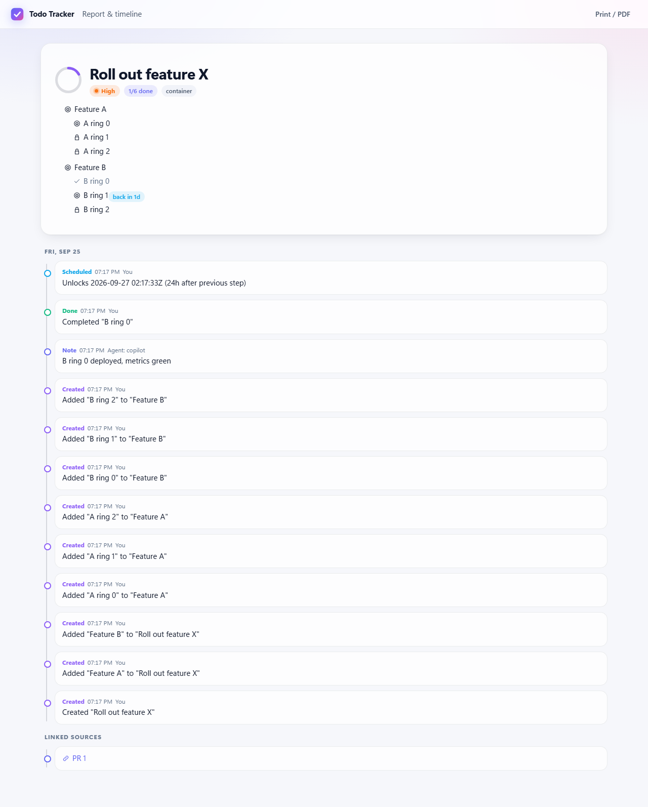

# Todo Tracker

An ADHD-friendly task sidebar that always tells you **what to do now**. Deferred work stays out of sight and comes
back on time with a reminder. Rollout steps unlock themselves 24 hours apart, and AI apps (Claude, Copilot, ChatGPT,
VS Code…) can read your list and add, organize and finish tasks for you.

Your tasks are **plain markdown files in a folder you own**, ready for Obsidian, git, sync services, and AI agents
that work with files. Every change is versioned, and nothing needs a Save button.

| | |
|---|---|
| **Windows** | Native WPF sidebar docked to the screen edge (maximized windows don't cover it), toasts, `Ctrl+Alt+Space` quick capture |
| **Web** | Dashboard and full report/timeline at `http://127.0.0.1:5317` |
| **macOS / iOS** | Native SwiftUI apps (macOS adds a menu bar glance) |
| **Browser** | Edge/Chrome side panel: glance, capture, and notes that attach the current page |
| **AI apps** | `tt mcp` (stdio) and `/mcp` (HTTP) MCP servers, a Claude Desktop extension, a Claude Code / Copilot CLI plugin with a skill, OpenAPI for GPT Actions and Copilot Studio; changes are attributed to the agent |
| **Terminal** | `tt` CLI: `tt now`, `tt add …`, `tt done …`, `--json` for scripts and agents |
| **Teams** | Reminder cards through a Teams Workflows webhook |
| **Files** | An Obsidian-compatible markdown vault (`Documents/Todo Tracker` by default), with version history |

The full plan, design, rules, and requirement traceability are in [`docs/product-spec.md`](docs/product-spec.md). The original request is in [`docs/request.md`](docs/request.md).

## Screenshots

| Web dashboard | Dark mode |
|---|---|
|  |  |

| Windows sidebar | macOS / iOS | Browser side panel |
|---|---|---|
|  |  |  |

The report page shows the full task tree and a timeline: 

## Quick start (Windows)

```powershell
dotnet run --project src/TodoTracker.Windows
```

The sidebar docks on the right. To move it, use **⋯ › Position**:
- **Dock right** or **Dock left** reserves that edge, on any monitor.
- **Float as a window** makes it a normal window you can drag and resize. Turn on **⋯ › Always on top** if you want it
  to stay above other windows.

Your choice is remembered. **Order Do now your way:** drag a card (drop it on the big card to make it the focus),
or use its ↑/↓ buttons or Alt+↑/↓. Subtasks reorder the same way in the task panel.

Type a task in the box at the top and press Enter:

```
Deploy ring 2 !! @2h due:tomorrow      →  critical, back in 2h with a reminder, due tomorrow 17:00
```

To set up a rollout, open the task (⋯ › *Edit details in browser* › *Add rollout steps*), enter one step per line,
and choose 24 hours between steps. Only the current step shows in **Do now**. When you finish it, the next step
waits 24 hours and then comes back with a reminder.

### Where your tasks live

Tasks are markdown files in **Documents/Todo Tracker**: one folder per group (tab), one file per task, with subtasks
as checkboxes (Obsidian Tasks syntax), notes as callouts, and attachments next to them. Edit them anywhere: in the
app, in Obsidian, in an editor, or with an AI agent. The app picks the changes up. See
[`docs/vault-format.md`](docs/vault-format.md).

- **Use Obsidian:** **⋯ › Tasks folder › Keep tasks in an Obsidian vault** lists your vaults. The app then uses
  `<vault>/Todo Tracker` (restart to switch). Any task opens in Obsidian from its menu or the web drawer.
- **Pointing the app at existing notes is safe.** It reads them without rewriting anything until you change a task.
- **History:** every change is saved as a version (needs `git`). Open a task in the web drawer › *History* to view or
  restore a version.
- **Tags, labels, search:** add `#tags` and colored labels to tasks; click one (or press `/`) to filter. The same
  syntax works everywhere: `#release label:"Deep work" group:work is:done words`.

### Connect AI apps

Choose **⋯ › Connect an AI app** (or ✨ in the web dashboard), pick Claude Code, Copilot CLI, Claude Desktop, VS Code
or another app, and copy the one line it shows. For example:

```bash
claude mcp add todo-tracker --scope user -- tt mcp
```

`tt mcp` works on your tasks folder directly, so AI apps work even when Todo Tracker isn't running. There is also a
Claude Desktop extension (`.mcpb`), a plugin with a skill for Claude Code and Copilot CLI
(`/plugin marketplace add shahabmokhtari/todo-tracker`), and OpenAPI descriptions for cloud tools. See
[`docs/ai-connectors.md`](docs/ai-connectors.md), including ChatGPT and Copilot Studio.

### Browser extension

1. Open `edge://extensions` or `chrome://extensions`, turn on developer mode, choose **Load unpacked**, and select the `extension/` folder.
2. Open the side panel and paste the token from sidebar menu **⋯ › Copy API token**.

### Teams reminders

Choose sidebar menu **⋯ › Connect Teams reminders…** and paste a Teams Workflows webhook URL.

## Other platforms

```bash
# Web dashboard / API / MCP without the WPF shell (any OS)
dotnet run --project src/TodoTracker.Web -- --port 5317 --data ./data

# macOS / iOS (on a Mac with Xcode)
cd apple/TodoTrackerKit && swift test
cd apple && brew install xcodegen && xcodegen generate && open TodoTracker.xcodeproj
```

## Development

```bash
dotnet build TodoTracker.slnx -warnaserror
dotnet test --solution TodoTracker.slnx               # xUnit v3 on Microsoft Testing Platform
node --test tests/web/*.test.mjs extension/tests/*.test.mjs
cd tests/e2e && npm install && npx playwright install chromium && npx playwright test
```

`src/TodoTracker.Windows/bin/.../TodoTracker.exe --smoke-test --smoke-log smoke.log` boots the real app against a
temporary board and verifies that the API and the sidebar see the same data. CI runs it on every PR.

System tests drive the real sidebar with UI Automation on the live Windows shell (pass `-Exe <path to TodoTracker.exe>`):
* `tests/system/placement.system-test.ps1`: dock right/left, float, always on top, persistence across restarts,
  and a floating window being pulled back on screen after a display change. Runs in Windows CI.
* `tests/system/multimonitor.system-test.ps1`: docks and floats on every display (including displays at negative
  coordinates), checks that only that display's work area changes, that the display is saved by its stable device
  path, and that a display change keeps the sidebar on it. Needs two or more monitors, so it skips in CI.
  Run it locally after changing placement code.

| Path | What |
|---|---|
| `src/TodoTracker.Core` | Domain model, agenda rules, search, quick capture, focus timer, markdown vault store and history, reminder dispatcher |
| `src/TodoTracker.Server` | REST API, MCP tools, security, Teams notifier, reminder loop, embedded web UI (`wwwroot`) |
| `src/TodoTracker.Web` | Standalone server host |
| `src/TodoTracker.Cli` | `tt` command and `tt mcp` (MCP over stdio) |
| `integrations/` | Claude Desktop extension manifest, Claude Code / Copilot CLI plugin and skill, VS Code sample |
| `src/TodoTracker.Desktop` | Platform-neutral view models for the sidebar |
| `src/TodoTracker.Windows` | WPF sidebar (AppBar, toasts, hotkey) |
| `apple/` | Swift core port, SwiftUI UI, and XcodeGen project for iOS and macOS |
| `extension/` | Edge/Chrome side panel extension |
| `tests/fixtures/scenarios` | Shared agenda scenarios run by both the C# and Swift tests |

CI (`.github/workflows/ci.yml`) runs on Linux (core, server, CLI, view models, coverage gates), web (JS tests and
Playwright), AI connectors (the `tt` tool package, self-contained `tt` and Claude Desktop extensions for Windows, macOS
and Linux, manifest validation, an MCP smoke test of the bundle), Windows (full build, tests, publish, smoke test), and
macOS (Swift tests, iOS and macOS app builds).
